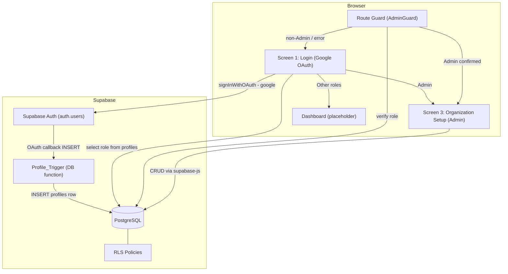

# Design Document: AssetFlow Stage 1

## Overview

AssetFlow Stage 1 delivers the foundational infrastructure for the asset management system. The scope covers four areas:

1. **Supabase Database Schema** — three tables (`profiles`, `departments`, `asset_categories`) with strict relational integrity, default values, and enum constraints.
2. **Row Level Security (RLS)** — Supabase Postgres RLS policies that enforce role-based read/write access on every table without application-layer enforcement.
3. **Authentication & Routing (Screen 1)** — Google OAuth sign-in with automatic role-based routing using Supabase Auth. No email/password forms.
4. **Admin Organization Panel (Screen 3)** — A protected, tab-based UI for managing departments, asset categories, and employee role/department assignments.

The stack is:
- **Frontend**: React (TypeScript) with React Router v6
- **Backend/Auth/DB**: Supabase (PostgreSQL + Supabase Auth + RLS)
- **Client Library**: `@supabase/supabase-js` v2

---

## Architecture



### Key Design Decisions

**Decision 1 — RLS as the sole authorization layer**  
All write permissions are enforced entirely by Postgres RLS policies. The frontend never checks role before a mutation; the database simply rejects unauthorized operations. This prevents privilege escalation even if the client is compromised.

**Decision 2 — Profile auto-creation via DB trigger, not application code**  
Creating a profile in application code after `signUp()` is a race condition: the trigger fires atomically within the same transaction as the `auth.users` INSERT, guaranteeing no orphaned auth accounts.

**Decision 3 — Email stored in `profiles.email`**  
Copying email from `auth.users` into `profiles` allows the Employee Directory to be built with a single table query, avoiding a join to the internal `auth.users` table which is inaccessible from RLS-governed queries in the `public` schema.

**Decision 4 — `ON DELETE RESTRICT` for `parent_department_id`**  
Departments with child departments cannot be deleted, preventing orphaned hierarchy nodes. This is enforced at the FK constraint level, not in application code.

**Decision 5 — `SECURITY DEFINER` helper to break RLS recursion**  
Any RLS policy on `profiles` that reads from `profiles` to check the caller's role (e.g. `SELECT role FROM profiles WHERE id = auth.uid()`) triggers the same RLS evaluation engine recursively, causing a `maximum recursion depth exceeded` crash. The fix is a dedicated `is_admin()` function marked `SECURITY DEFINER`: it executes under the function owner's privileges, bypassing RLS entirely when reading the caller's role. All policies that need to check for Admin use `is_admin()` instead of an inline subquery.

**Decision 6 — Deferred `head_id` FK to resolve circular dependency**  
`departments.head_id` references `profiles.id`, but `profiles` must be created after `departments` (because `profiles.department_id` references `departments`). The `head_id` FK is therefore omitted from the initial `CREATE TABLE departments` statement and added via `ALTER TABLE departments ADD CONSTRAINT` after `profiles` exists.

**Decision 7 — Google OAuth only, no email/password**  
All authentication flows through Supabase Google OAuth (`signInWithOAuth({ provider: 'google' })`). This eliminates password management complexity, removes client-side email/password validation from the auth path, and avoids the separate signup/login distinction. New users are created automatically on first OAuth login — the Profile_Trigger fires on the resulting `auth.users` INSERT and creates the profile row with `full_name` sourced from `raw_user_meta_data` (Google populates `raw_user_meta_data.name` and `raw_user_meta_data.full_name`). The trigger checks `full_name` first, then falls back to `name`.

---

## Project Structure

```
assetflow-stage1/
├── supabase/
│   ├── schema.sql                          # Full schema: enums, tables, functions, triggers, RLS
│   └── migration_YYYYMMDD_<desc>.sql       # Incremental migrations (added as schema evolves)
│
└── src/
    ├── App.tsx                             # React Router v6 route definitions
    ├── main.tsx                            # Vite entry point
    ├── vite-env.d.ts                       # Vite env type declarations
    │
    ├── lib/
    │   ├── supabaseClient.ts               # Typed Supabase client instance
    │   └── database.types.ts              # Auto-generated by `supabase gen types typescript`
    │
    ├── types/
    │   └── index.ts                        # Shared TS types: UserRole, ActiveStatus, Profile, Department, AssetCategory
    │
    ├── services/
    │   └── authService.ts                  # signUp, signIn, signOut, getCurrentUserRole
    │
    ├── utils/
    │   └── validation.ts                   # isValidEmail, isValidPassword, isValidFullName, isNonBlankName
    │
    ├── components/
    │   ├── AdminGuard.tsx                  # Route guard — redirects non-Admins
    │   ├── DepartmentsTab.tsx              # Departments data grid + Add New Department modal
    │   ├── CategoriesTab.tsx               # Asset categories data grid + Add Category modal
    │   └── EmployeeDirectoryTab.tsx        # Employee directory data grid + edit modal
    │
    ├── pages/
    │   ├── LoginSignup.tsx                 # Screen 1: login + signup forms
    │   ├── Dashboard.tsx                   # Placeholder dashboard for non-Admin roles
    │   └── OrganizationSetup.tsx           # Screen 3: tab container (Admin only)
    │
    └── __tests__/
        ├── unit/
        │   ├── validation.test.ts
        │   ├── routing.test.ts
        │   └── adminGuard.test.tsx
        ├── property/
        │   ├── profileDefaults.property.ts
        │   ├── nameValidation.property.ts
        │   ├── categoryOrder.property.ts
        │   └── modalCancel.property.ts
        └── integration/
            ├── trigger.test.ts
            ├── rls.test.ts
            └── constraints.test.ts
```

### Naming Conventions

| Item | Convention | Example |
|------|-----------|---------|
| React components | PascalCase | `AdminGuard.tsx`, `DepartmentsTab.tsx` |
| Services & utilities | camelCase | `authService.ts`, `validation.ts` |
| Type definitions | camelCase | `index.ts` in `types/` |
| Test files | `*.test.ts` / `*.test.tsx` | `validation.test.ts` |
| Property test files | `*.property.ts` | `nameValidation.property.ts` |
| SQL migration files | `migration_YYYYMMDD_<description>.sql` | `migration_20260712_add_email_to_profiles.sql` |
| Supabase generated types | `database.types.ts` | do not rename or hand-edit |

---

## Components and Interfaces

### Supabase Client Module

**File**: `src/lib/supabaseClient.ts`

```typescript
import { createClient } from '@supabase/supabase-js'
import type { Database } from './database.types'

export const supabase = createClient<Database>(
  import.meta.env.VITE_SUPABASE_URL,
  import.meta.env.VITE_SUPABASE_ANON_KEY
)
```

The `Database` type is generated by the Supabase CLI (`supabase gen types typescript`) and provides end-to-end type safety for all queries.

---

### Authentication Service

**File**: `src/services/authService.ts`

```typescript
interface AuthResult {
  error: string | null
  role?: UserRole
}

async function signInWithGoogle(): Promise<void>  // redirects to Google OAuth; no return value
async function handleOAuthCallback(): Promise<AuthResult>  // called on the /auth/callback route; reads role after session established
async function signOut(): Promise<void>
async function getCurrentUserRole(): Promise<UserRole | null>
```

`handleOAuthCallback()` calls `supabase.auth.getSession()` to confirm the session after the OAuth redirect, then executes `supabase.from('profiles').select('role').eq('id', user.id).single()` and returns the role. This is also used for routing immediately after sign-in.

`getCurrentUserRole()` is called both post-login (for routing) and by the Route Guard on every protected navigation.

---

### Route Guard Component

**File**: `src/components/AdminGuard.tsx`

```typescript
// Renders children only when role === 'Admin'
// Shows loading spinner during async role verification
// Redirects to '/' (Screen 1) on error or unauthenticated
// Redirects to '/dashboard' on authenticated non-Admin
interface AdminGuardProps {
  children: React.ReactNode
}
```

Implemented as a React component wrapping protected routes using `<Navigate>` from React Router v6. The guard does **not** cache the role — it re-queries on every navigation to the protected route.

---

### Organization Setup Page (Screen 3)

**File**: `src/pages/OrganizationSetup.tsx`

Three tabs rendered via a tab component:

| Tab | Component | Data Source |
|-----|-----------|-------------|
| Departments | `DepartmentsTab` | `departments` table |
| Categories | `CategoriesTab` | `asset_categories` table |
| Employee Directory | `EmployeeDirectoryTab` | `profiles` table |

Each tab follows this pattern:
1. On mount, fetch all rows from its table.
2. Render a `DataGrid` with the specified columns.
3. Provide an "Add" / "Edit" button that opens a controlled modal.
4. On modal submit, execute the Supabase `insert` or `update` call, then re-fetch the table data.

---

### Validation Helpers

**File**: `src/utils/validation.ts`

```typescript
function isValidEmail(value: string): boolean    // kept for potential future use; NOT called in the auth flow
function isValidPassword(value: string): boolean // kept for potential future use; NOT called in the auth flow
function isValidFullName(value: string): boolean // non-empty, ≤100 chars
function isNonBlankName(value: string, maxLen: number): boolean  // for dept/category names
```

With Google OAuth, there is no client-side email/password validation in the auth path. `isNonBlankName` and `isValidFullName` are still used for form fields in the Organization Setup panel.

---

## Data Models

### TypeScript Types

```typescript
type UserRole = 'Employee' | 'Department Head' | 'Asset Manager' | 'Admin'
type ActiveStatus = 'Active' | 'Inactive'

interface Profile {
  id: string           // UUID
  full_name: string | null
  email: string
  role: UserRole
  department_id: string | null   // UUID FK → departments.id
  status: ActiveStatus
  created_at: string   // ISO 8601 timestamp
}

interface Department {
  id: string           // UUID
  name: string
  head_id: string | null           // UUID FK → profiles.id
  parent_department_id: string | null  // UUID FK → departments.id (self-ref)
  status: ActiveStatus
}

interface AssetCategory {
  id: string           // UUID
  name: string
  attributes: Record<string, unknown> | null  // JSONB
  created_at: string   // ISO 8601 timestamp
}
```

### SQL Schema

```sql
-- Enums
CREATE TYPE user_role AS ENUM ('Employee', 'Department Head', 'Asset Manager', 'Admin');
CREATE TYPE active_status AS ENUM ('Active', 'Inactive');

-- Step 1: Create departments WITHOUT the head_id FK (profiles doesn't exist yet)
CREATE TABLE departments (
  id                   UUID PRIMARY KEY DEFAULT gen_random_uuid(),
  name                 TEXT NOT NULL UNIQUE CHECK (char_length(name) BETWEEN 1 AND 100),
  head_id              UUID,  -- FK constraint added below after profiles is created
  parent_department_id UUID REFERENCES departments(id) ON DELETE RESTRICT,
  status               active_status NOT NULL DEFAULT 'Active'
);

-- Step 2: Create profiles (references departments, which now exists)
CREATE TABLE profiles (
  id            UUID PRIMARY KEY REFERENCES auth.users(id) ON DELETE CASCADE,
  full_name     TEXT CHECK (char_length(full_name) <= 255),
  email         TEXT NOT NULL CHECK (char_length(email) <= 254),
  role          user_role NOT NULL DEFAULT 'Employee',
  department_id UUID REFERENCES departments(id),
  status        active_status NOT NULL DEFAULT 'Active',
  created_at    TIMESTAMPTZ NOT NULL DEFAULT now()
);

-- Step 3: Now that profiles exists, add the head_id FK to departments
ALTER TABLE departments
  ADD CONSTRAINT departments_head_id_fkey
  FOREIGN KEY (head_id) REFERENCES profiles(id) ON DELETE SET NULL;

-- Asset Categories (no dependency ordering issue)
CREATE TABLE asset_categories (
  id         UUID PRIMARY KEY DEFAULT gen_random_uuid(),
  name       TEXT NOT NULL UNIQUE CHECK (char_length(name) BETWEEN 1 AND 100),
  attributes JSONB,
  created_at TIMESTAMPTZ NOT NULL DEFAULT now()
);

-- SECURITY DEFINER helper: reads caller's role bypassing RLS to prevent infinite recursion
-- All RLS policies that need to check for Admin MUST use this function, never an inline subquery.
CREATE OR REPLACE FUNCTION is_admin()
RETURNS BOOLEAN LANGUAGE sql SECURITY DEFINER STABLE SET search_path = public AS $$
  SELECT EXISTS (
    SELECT 1 FROM public.profiles
    WHERE id = auth.uid() AND role = 'Admin'
  );
$$;

-- Profile auto-creation trigger
-- Google OAuth populates raw_user_meta_data with 'full_name' and/or 'name'.
-- Try 'full_name' first (set by email/password signUp metadata), then fall back to 'name' (set by Google OAuth).
CREATE OR REPLACE FUNCTION handle_new_user()
RETURNS TRIGGER LANGUAGE plpgsql SECURITY DEFINER SET search_path = public AS $$
BEGIN
  INSERT INTO public.profiles (id, email, full_name, role, status)
  VALUES (
    NEW.id,
    NEW.email,
    NULLIF(TRIM(COALESCE(
      NULLIF(TRIM((NEW.raw_user_meta_data->>'full_name')::TEXT), ''),
      NULLIF(TRIM((NEW.raw_user_meta_data->>'name')::TEXT), '')
    )), ''),
    'Employee',
    'Active'
  );
  RETURN NEW;
END;
$$;

CREATE TRIGGER on_auth_user_created
  AFTER INSERT ON auth.users
  FOR EACH ROW EXECUTE FUNCTION handle_new_user();

-- RLS: Profiles
ALTER TABLE profiles ENABLE ROW LEVEL SECURITY;

CREATE POLICY "profiles_select_authenticated"
  ON profiles FOR SELECT
  USING (auth.role() = 'authenticated');

CREATE POLICY "profiles_insert_denied"
  ON profiles FOR INSERT
  WITH CHECK (false);

CREATE POLICY "profiles_update_own_fullname"
  ON profiles FOR UPDATE
  USING (auth.uid() = id)
  WITH CHECK (auth.uid() = id);

-- Uses is_admin() to avoid the RLS infinite recursion trap
CREATE POLICY "profiles_update_admin_fields"
  ON profiles FOR UPDATE
  USING (is_admin())
  WITH CHECK (is_admin());

CREATE POLICY "profiles_delete_denied"
  ON profiles FOR DELETE
  USING (false);

-- RLS: Departments
ALTER TABLE departments ENABLE ROW LEVEL SECURITY;

CREATE POLICY "departments_select_authenticated"
  ON departments FOR SELECT
  USING (auth.role() = 'authenticated');

CREATE POLICY "departments_admin_insert"
  ON departments FOR INSERT
  WITH CHECK (is_admin());

CREATE POLICY "departments_admin_update"
  ON departments FOR UPDATE
  USING (is_admin());

CREATE POLICY "departments_admin_delete"
  ON departments FOR DELETE
  USING (is_admin());

-- RLS: Asset Categories
ALTER TABLE asset_categories ENABLE ROW LEVEL SECURITY;

CREATE POLICY "asset_categories_select_authenticated"
  ON asset_categories FOR SELECT
  USING (auth.role() = 'authenticated');

CREATE POLICY "asset_categories_admin_insert"
  ON asset_categories FOR INSERT
  WITH CHECK (is_admin());

CREATE POLICY "asset_categories_admin_update"
  ON asset_categories FOR UPDATE
  USING (is_admin());

CREATE POLICY "asset_categories_admin_delete"
  ON asset_categories FOR DELETE
  USING (is_admin());
```

> **Schema ordering note**: The `departments` table is created first without its `head_id` FK because `profiles` doesn't exist yet. The FK is added via `ALTER TABLE departments ADD CONSTRAINT departments_head_id_fkey FOREIGN KEY (head_id) REFERENCES profiles(id) ON DELETE SET NULL` after `profiles` is created. The `is_admin()` helper function must be created before any RLS policies that call it.

### Migration Convention

New migration files are placed in `supabase/` named `migration_YYYYMMDD_<description>.sql` containing only the incremental DDL. The base `supabase/schema.sql` is kept in sync with the cumulative state.


---

## Correctness Properties

*A property is a characteristic or behavior that should hold true across all valid executions of a system — essentially, a formal statement about what the system should do. Properties serve as the bridge between human-readable specifications and machine-verifiable correctness guarantees.*

---

### Property 1: Profile creation defaults

*For any* valid Google OAuth sign-in (any Google account), the automatically created `profiles` row SHALL have `role = 'Employee'`, `status = 'Active'`, `department_id = NULL`, and `full_name` populated from `raw_user_meta_data.full_name` if present and non-empty, otherwise from `raw_user_meta_data.name` if present and non-empty, otherwise NULL.

**Validates: Requirements 1.2, 1.3, 1.5, 5.1, 5.2, 9.4**

---

### Property 2: Cascade delete removes profile

*For any* user created via Supabase Auth, deleting the corresponding `auth.users` record SHALL result in the `profiles` row with the same `id` being removed from the `profiles` table, leaving no orphaned profile.

**Validates: Requirements 1.6**

---

### Property 3: Department name uniqueness rejection

*For any* department name string that already exists in the `departments` table, a second `INSERT` (or `UPDATE` to that same name) SHALL be rejected with a constraint violation, leaving the table state unchanged.

**Validates: Requirements 2.2, 12.7**

---

### Property 4: Invalid status enum rejected

*For any* string value that is not `'Active'` or `'Inactive'`, an `INSERT` or `UPDATE` on the `departments` or `profiles` table setting the `status` column to that value SHALL be rejected with a constraint violation error.

**Validates: Requirements 2.5**

---

### Property 5: Authenticated SELECT access

*For any* authenticated user (regardless of role), `SELECT` queries on `profiles`, `departments`, and `asset_categories` SHALL succeed and return visible rows.

**Validates: Requirements 6.1, 7.1, 8.1**

---

### Property 6: Admin-only profile field updates (with self-elevation prevention)

*For any* Admin user and any target `profiles` row, the Admin SHALL be able to `UPDATE` the `role`, `department_id`, and `status` fields. *For any* non-Admin authenticated user (including the target user themselves), attempting to `UPDATE` the `role`, `department_id`, or `status` column of any `profiles` row — including their own — SHALL be denied by RLS with an error.

**Validates: Requirements 6.2, 6.3, 6.6, 15.3**

---

### Property 7: Direct INSERT on profiles is always denied

*For any* authenticated user (any role), a direct `INSERT` statement on the `profiles` table SHALL be rejected by RLS with an error.

**Validates: Requirements 6.4**

---

### Property 8: Direct DELETE on profiles is always denied

*For any* authenticated user (any role), a `DELETE` statement on the `profiles` table SHALL be rejected by RLS with an error.

**Validates: Requirements 6.5**

---

### Property 9: Admin-only write access to departments

*For any* authenticated user with `role != 'Admin'`, any `INSERT`, `UPDATE`, or `DELETE` operation on the `departments` table SHALL be denied by RLS with an error, resulting in zero rows affected. *For any* authenticated Admin, these same operations SHALL succeed.

**Validates: Requirements 7.3, 7.4, 7.5**

---

### Property 10: Admin-only write access to asset categories

*For any* authenticated user with `role != 'Admin'`, any `INSERT`, `UPDATE`, or `DELETE` operation on the `asset_categories` table SHALL be denied by RLS with an error, resulting in zero rows affected. *For any* authenticated Admin, these same operations SHALL succeed.

**Validates: Requirements 8.2, 8.3, 8.4, 8.5, 8.6, 8.7**

---

### ~~Property 11: Removed~~

*This property previously described signup form validation rejecting invalid inputs before the Auth_Service call. It no longer applies because Screen 1 contains no user-input fields — authentication is handled entirely via Google OAuth redirect.*

---

### Property 12: Valid department creation persists

*For any* non-empty, non-whitespace-only department name of at most 100 characters that does not already exist in the `departments` table, submitting the "Add New Department" form SHALL result in exactly one new row in the `departments` table with the supplied name.

**Validates: Requirements 12.5**

---

### Property 13: Whitespace department name is rejected

*For any* string composed entirely of whitespace characters submitted as a department name, the form SHALL display a validation error and SHALL NOT insert any row into the `departments` table.

**Validates: Requirements 12.6**

---

### Property 14: Valid asset category creation persists

*For any* non-empty, non-whitespace-only category name of at most 100 characters that does not already exist in the `asset_categories` table, submitting the "Add Category" form SHALL result in exactly one new row in the `asset_categories` table.

**Validates: Requirements 13.5**

---

### Property 15: Whitespace category name is rejected

*For any* string composed entirely of whitespace characters submitted as a category name, the form SHALL display a validation error and SHALL NOT insert any row into the `asset_categories` table.

**Validates: Requirements 13.6**

---

### Property 16: Categories grid maintains alphabetical order

*For any* set of asset category records in the `asset_categories` table, the Categories tab Data_Grid SHALL display them in ascending alphabetical order by name.

**Validates: Requirements 13.2**

---

### Property 17: Modal cancel leaves table unchanged

*For any* open "Add Category" or "Add New Department" modal, dismissing or cancelling the modal SHALL result in zero rows inserted, updated, or deleted in the corresponding table.

**Validates: Requirements 13.8**

---

### Property 18: Admin employee update is persisted

*For any* employee profile and any combination of valid `role` and `department_id` values, an Admin submitting the employee modal SHALL result in those exact `role` and `department_id` values being written to the corresponding `profiles` row, which SHALL then be reflected in the Data_Grid on the next fetch.

**Validates: Requirements 14.6**

---

## Error Handling

### Authentication Errors

| Scenario | Behavior |
|----------|----------|
| Google OAuth flow cancelled or failed | Display "Sign-in failed. Please try again." on Screen 1 |
| Network error during OAuth redirect | Display "Sign-in failed. Please try again." on Screen 1 |
| Profile not found after OAuth callback | Display "Account configuration error. Contact your administrator." |
| Profile trigger failure (rollback) | Auth and profiles both clean; user sees "Sign-in failed. Please try again." |

### Route Guard Errors

| Scenario | Behavior |
|----------|----------|
| Role query fails (DB/network error) | Redirect to Screen 1; do not render Screen 3 content |
| User session expired before guard resolves | Redirect to Screen 1 |
| `role` is NULL or unrecognized in profiles | Display "Account configuration error. Contact your administrator." |

### Form Validation Errors (Client-Side, before Supabase call)

These apply only to the Organization Setup panel forms. Screen 1 has no user-input fields.

| Field | Rule | Error Message |
|-------|------|---------------|
| Department Name | Non-blank, ≤100 chars | "Department name is required" |
| Category Name | Non-blank, ≤100 chars | "Category name is required" |

### Database / RLS Errors (Server-Side)

| Scenario | Behavior |
|----------|----------|
| Duplicate department name | Modal stays open; display "A department with this name already exists" |
| Duplicate category name | Modal stays open; display "A category with this name already exists" |
| RLS policy violation (non-Admin write) | Log error; display "You don't have permission to perform this action" |
| Employee profile UPDATE fails | Modal stays open with preserved values; display "Update failed. Please try again." |
| Unexpected DB error | Log to console; display generic "Something went wrong. Please try again." |

---

## Testing Strategy

### Overview

This feature combines database infrastructure, RLS policies, and UI screens. The testing approach uses three layers:

1. **Unit / Property-based tests** — validate pure frontend logic (form validation, routing logic, data transformation) using a property-based testing library
2. **Integration tests** — validate Supabase interactions (RLS policies, trigger behavior) against the cloud Supabase project
3. **Smoke tests** — one-time manual verification in the Supabase Dashboard after applying the schema

> **Deployment model**: Cloud Supabase only. There is no local Supabase instance. Authentication uses Google OAuth managed by the cloud Supabase Auth service — no email/password forms exist. All database, RLS, and trigger behaviour runs on the cloud project connected via `VITE_SUPABASE_URL`. Google OAuth requires the Google provider to be enabled in the Supabase Dashboard → Authentication → Providers.

### Property-Based Testing

PBT applies to all 18 correctness properties listed above. This feature has rich opportunities for property testing because:
- Input validation logic varies meaningfully across large input spaces (email strings, name strings, passwords)
- RLS access control logic must hold for all users of a given role class
- Data grid ordering must hold for any set of records

**Library**: [fast-check](https://github.com/dubzzz/fast-check) (TypeScript-native PBT library)

**Configuration**: Each property test runs a minimum of **100 iterations**.

**Tag format** for test annotations:
```
// Feature: assetflow-stage1, Property {N}: {property_text}
```

**Example property test structure**:
```typescript
import fc from 'fast-check'

// Feature: assetflow-stage1, Property 13: Whitespace department name is rejected
test('whitespace department name is rejected', () => {
  fc.assert(
    fc.property(
      fc.stringOf(fc.constantFrom(' ', '\t', '\n', '\r')).filter(s => s.length > 0),
      (whitespaceOnly) => {
        const result = validateDepartmentName(whitespaceOnly)
        expect(result.valid).toBe(false)
        expect(result.error).toBeTruthy()
      }
    ),
    { numRuns: 100 }
  )
})
```

### Integration Tests (Supabase Cloud)

Run against the cloud Supabase project using the credentials in `.env.local`. These tests cover:
- Profile_Trigger auto-creation (Properties 1, 2)
- RLS enforcement for each table and each role (Properties 5–10)
- Cascade delete behavior (Property 2)
- Enum constraint rejection (Property 4)

Each integration test uses representative examples (1–3 per scenario) rather than randomized inputs, as the behavior doesn't vary meaningfully with input at the infrastructure level.

> **Note**: There is no local Supabase instance. All cloud interactions (Auth, database, RLS) are handled by the cloud project at `VITE_SUPABASE_URL`. Google OAuth is fully managed by the Supabase Auth service — Google provider must be enabled in the Supabase Dashboard under Authentication → Providers.

### Unit Tests (Frontend Logic)

Example-based unit tests cover:
- `isNonBlankName` helper function (auth-path validators `isValidEmail`/`isValidPassword` are retained but not tested as part of the auth flow)
- `AdminGuard` component: loading state, redirect on non-Admin, redirect on unauthenticated, redirect on error
- Role-based routing after OAuth callback: one test per role value
- Modal cancel behavior: modal closes, no network call made

### Smoke Tests (One-Time Checks)

- `supabase/schema.sql` can be applied to a clean Supabase project without error
- All three tables exist with expected column names and types
- RLS is enabled on all three tables
- `is_admin()` function exists and is marked `SECURITY DEFINER`
- Profile_Trigger function and trigger exist

### Test File Structure

See the **Project Structure** section above for the full file tree. Tests are organized under `src/__tests__/` with three subdirectories:

- `unit/` — example-based tests for pure functions and components
- `property/` — fast-check property tests (min 100 iterations each)
- `integration/` — tests requiring a live local Supabase instance (`supabase start`)
