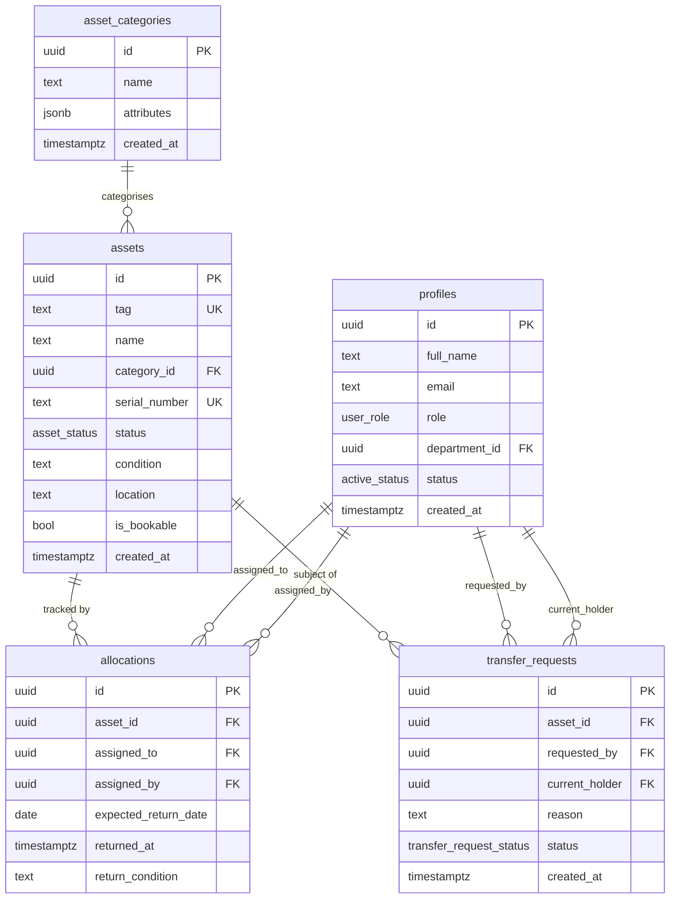
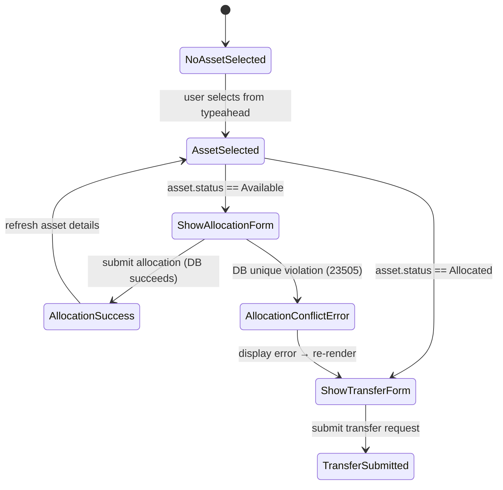

# Design Document — AssetFlow Stage 2: Asset Core & Allocation Engine

## Overview

AssetFlow Stage 2 extends the Stage 1 infrastructure (profiles, departments, asset_categories, RLS, is_admin() helper, AdminGuard component) with a complete asset lifecycle engine. The goal is to enable Asset Managers to register physical assets, allocate them to employees, and handle transfer requests — with the database as the ultimate arbiter of correctness. The most critical design decision is enforcing the "Conflict Rule" at the PostgreSQL layer via a partial unique index, making double-allocation mathematically impossible regardless of frontend behavior.

**Research basis:** PostgreSQL partial indexes (`WHERE` clause on a `CREATE UNIQUE INDEX`) are a well-established mechanism for conditional uniqueness. Supabase exposes this through the SQL editor and it participates in row-level security correctly. AFTER triggers on INSERT/UPDATE are transactional in PostgreSQL — if the trigger function raises an exception, the originating statement is rolled back atomically. `SECURITY DEFINER` functions (following the pattern already used by `is_admin()`) bypass RLS when reading the `profiles` table, which is necessary to avoid infinite recursion in RLS policies that need to check the caller's role.

---

## Architecture

The system follows the same layered architecture established in Stage 1:

```
Browser (React + TypeScript + Vite)
  └── Pages (src/pages/)
        ├── AssetDirectory.tsx        ← Screen 4
        └── AllocationTransfer.tsx    ← Screen 5
  └── Components (src/components/)
        ├── RegisterAssetModal.tsx    ← Screen 4 modal
        └── AllocationHistory.tsx     ← Screen 5 history panel
  └── Services (src/services/)
        ├── assetService.ts           ← CRUD for assets table
        └── allocationService.ts      ← CRUD for allocations + transfer_requests
  └── Types (src/types/index.ts)      ← extended with Stage 2 domain types
  └── Lib (src/lib/supabaseClient.ts) ← unchanged, shared client

Supabase Cloud (PostgreSQL)
  └── Schema additions (additive migration)
        ├── Sequence: asset_tag_seq
        ├── Enum:     asset_status, transfer_request_status
        ├── Tables:   assets, allocations, transfer_requests
        ├── Index:    only_one_active_allocation (partial unique)
        ├── Trigger:  sync_asset_status() AFTER INSERT/UPDATE ON allocations
        ├── Function: is_asset_manager() SECURITY DEFINER
        └── RLS:      policies on all three new tables
```

The migration is a single additive SQL file (`supabase/migration_stage2_assets_allocation.sql`) that leaves all Stage 1 objects untouched.

---

## Components and Interfaces

### Route additions to `src/App.tsx`

Two new routes are added to the existing `BrowserRouter`:

| Path | Component | Guard |
|---|---|---|
| `/assets` | `AssetDirectory` | Auth required (all roles) |
| `/allocations` | `AllocationTransfer` | Auth required (all roles) |

The `AdminGuard` component is reused for admin-only sections. No new guard component is needed — Screen 4 and 5 are visible to all authenticated users; write operations are gated by RLS and button-level role checks in the UI.

### `src/pages/AssetDirectory.tsx` (Screen 4)

Responsibilities:
- Fetch and display all assets with joined category name
- Provide text/category/status filter controls
- Conditionally render "Register New Asset" button for Admin and Asset Manager roles
- Host the `RegisterAssetModal` component

Key local state:
- `assets: AssetWithCategory[]` — full list from DB
- `filters: { search: string; categoryId: string | null; status: AssetStatus | null }`
- `showModal: boolean`
- `currentUserRole: UserRole | null`

### `src/components/RegisterAssetModal.tsx`

A controlled modal form. Fields: Name (required), Category (required dropdown), Serial Number (optional), Condition (optional), Location (optional). No Tag field. On submit calls `assetService.createAsset()`. On DB unique violation for serial_number, renders inline error "Serial number already exists".

### `src/pages/AllocationTransfer.tsx` (Screen 5)

Responsibilities:
- Typeahead search field (fires after 2 characters, calls `assetService.searchAssets()`)
- On asset selection: loads full asset details + current active allocation holder
- Dynamic rendering: "Allocate Asset" form (status Available) or red warning + "Transfer Request" form (status Allocated)
- Hosts the `AllocationHistory` component

Key local state:
- `selectedAsset: AssetWithCategory | null`
- `activeAllocation: AllocationWithProfiles | null`
- `searchQuery: string`, `suggestions: AssetWithCategory[]`

### `src/components/AllocationHistory.tsx`

Receives `assetId: string` as prop. Fetches all allocations for that asset (ordered by `created_at DESC`), renders a timeline list. Active allocations (returned_at IS NULL) are visually highlighted. Shows "No previous allocations" when list is empty.

### `src/services/assetService.ts`

```typescript
// Public interface (types defined in src/types/index.ts)
export async function listAssets(): Promise<AssetWithCategory[]>
export async function searchAssets(query: string): Promise<AssetWithCategory[]>
export async function createAsset(input: CreateAssetInput): Promise<Asset>
```

All functions import `supabase` from `src/lib/supabaseClient.ts` (unchanged).

`listAssets` joins `asset_categories` to resolve `category_id` → `category_name`. `searchAssets` uses Supabase `.ilike()` on both `tag` and `name` columns with an OR filter. `createAsset` inserts a new row (omitting `tag` so the DB default fires) and returns the created record.

### `src/services/allocationService.ts`

```typescript
export async function getAllocationsForAsset(assetId: string): Promise<AllocationWithProfiles[]>
export async function getActiveAllocation(assetId: string): Promise<AllocationWithProfiles | null>
export async function createAllocation(input: CreateAllocationInput): Promise<Allocation>
export async function returnAllocation(allocationId: string): Promise<void>
export async function createTransferRequest(input: CreateTransferRequestInput): Promise<TransferRequest>
export async function getPendingTransferForAsset(assetId: string, requestedBy: string): Promise<TransferRequest | null>
```

`getAllocationsForAsset` joins `assigned_to` and `assigned_by` profiles for display. `createAllocation` inserts with `returned_at: null`. On a unique constraint violation (error code `23505`), the service re-throws a typed `AllocationConflictError` so the UI can display the right message.

---

## Data Models

### New TypeScript types (`src/types/index.ts` extensions)

```typescript
// ─── Stage 2 Enum Types ───────────────────────────────────────────────────────

export type AssetStatus =
  | 'Available'
  | 'Allocated'
  | 'Reserved'
  | 'Under Maintenance'
  | 'Lost'
  | 'Retired'
  | 'Disposed'

export type TransferRequestStatus = 'Pending' | 'Approved' | 'Rejected'

// ─── Domain Types ─────────────────────────────────────────────────────────────

export interface Asset {
  id: string
  tag: string
  name: string
  category_id: string
  serial_number: string | null
  status: AssetStatus
  condition: string | null
  location: string | null
  is_bookable: boolean
  created_at: string
}

export interface AssetWithCategory extends Asset {
  category_name: string  // resolved from JOIN on asset_categories
}

export interface Allocation {
  id: string
  asset_id: string
  assigned_to: string
  assigned_by: string
  expected_return_date: string | null  // ISO date string
  returned_at: string | null           // ISO timestamp; NULL = active
  return_condition: string | null
}

export interface AllocationWithProfiles extends Allocation {
  assigned_to_name: string | null
  assigned_by_name: string | null
}

export interface TransferRequest {
  id: string
  asset_id: string
  requested_by: string
  current_holder: string
  reason: string
  status: TransferRequestStatus
  created_at: string
}

// ─── Service Input Types ──────────────────────────────────────────────────────

export interface CreateAssetInput {
  name: string
  category_id: string
  serial_number?: string | null
  condition?: string | null
  location?: string | null
}

export interface CreateAllocationInput {
  asset_id: string
  assigned_to: string
  assigned_by: string
  expected_return_date?: string | null
}

export interface CreateTransferRequestInput {
  asset_id: string
  requested_by: string
  current_holder: string
  reason: string
}

// ─── Service Error Types ──────────────────────────────────────────────────────

export class AllocationConflictError extends Error {
  constructor(message = 'Asset is already allocated. Please refresh and try again.') {
    super(message)
    this.name = 'AllocationConflictError'
  }
}
```

### PostgreSQL Schema (additive migration)

**Sequence:**
```sql
CREATE SEQUENCE IF NOT EXISTS asset_tag_seq START 1 INCREMENT 1;
```

**Enums:**
```sql
CREATE TYPE asset_status AS ENUM (
  'Available', 'Allocated', 'Reserved',
  'Under Maintenance', 'Lost', 'Retired', 'Disposed'
);

CREATE TYPE transfer_request_status AS ENUM ('Pending', 'Approved', 'Rejected');
```

**assets table:**
```sql
CREATE TABLE assets (
  id            UUID PRIMARY KEY DEFAULT gen_random_uuid(),
  tag           TEXT NOT NULL UNIQUE
                  DEFAULT 'AF-' || LPAD(nextval('asset_tag_seq')::TEXT, 4, '0'),
  name          TEXT NOT NULL CHECK (char_length(name) BETWEEN 1 AND 255),
  category_id   UUID NOT NULL REFERENCES asset_categories(id) ON DELETE RESTRICT,
  serial_number TEXT UNIQUE,
  status        asset_status NOT NULL DEFAULT 'Available',
  condition     TEXT CHECK (condition IS NULL OR char_length(condition) <= 255),
  location      TEXT CHECK (location IS NULL OR char_length(location) <= 255),
  is_bookable   BOOLEAN NOT NULL DEFAULT false,
  created_at    TIMESTAMPTZ NOT NULL DEFAULT now()
);
```

**allocations table:**
```sql
CREATE TABLE allocations (
  id                   UUID PRIMARY KEY DEFAULT gen_random_uuid(),
  asset_id             UUID NOT NULL REFERENCES assets(id) ON DELETE RESTRICT,
  assigned_to          UUID NOT NULL REFERENCES profiles(id) ON DELETE RESTRICT,
  assigned_by          UUID NOT NULL REFERENCES profiles(id) ON DELETE RESTRICT,
  expected_return_date DATE,
  returned_at          TIMESTAMPTZ,
  return_condition     TEXT
);
```

**transfer_requests table:**
```sql
CREATE TABLE transfer_requests (
  id             UUID PRIMARY KEY DEFAULT gen_random_uuid(),
  asset_id       UUID NOT NULL REFERENCES assets(id) ON DELETE CASCADE,
  requested_by   UUID NOT NULL REFERENCES profiles(id) ON DELETE CASCADE,
  current_holder UUID NOT NULL REFERENCES profiles(id) ON DELETE CASCADE,
  reason         TEXT NOT NULL
                   CHECK (char_length(TRIM(reason)) > 0 AND char_length(reason) <= 1000),
  status         transfer_request_status NOT NULL DEFAULT 'Pending',
  created_at     TIMESTAMPTZ NOT NULL DEFAULT now()
);
```

**Partial unique index (the Conflict Rule):**
```sql
CREATE UNIQUE INDEX only_one_active_allocation
  ON allocations (asset_id)
  WHERE returned_at IS NULL;
```

**is_asset_manager() helper (mirrors is_admin() pattern):**
```sql
CREATE OR REPLACE FUNCTION is_asset_manager()
RETURNS BOOLEAN LANGUAGE sql SECURITY DEFINER STABLE SET search_path = public AS $$
  SELECT EXISTS (
    SELECT 1 FROM public.profiles
    WHERE id = auth.uid() AND role IN ('Admin', 'Asset Manager')
  );
$$;
```

**sync_asset_status() trigger:**
```sql
CREATE OR REPLACE FUNCTION sync_asset_status()
RETURNS TRIGGER LANGUAGE plpgsql SECURITY DEFINER SET search_path = public AS $$
BEGIN
  IF TG_OP = 'INSERT' AND NEW.returned_at IS NULL THEN
    UPDATE public.assets SET status = 'Allocated' WHERE id = NEW.asset_id;
  ELSIF TG_OP = 'UPDATE' AND NEW.returned_at IS NOT NULL AND OLD.returned_at IS NULL THEN
    UPDATE public.assets SET status = 'Available' WHERE id = NEW.asset_id;
  END IF;
  RETURN NEW;
END;
$$;

CREATE TRIGGER on_allocation_change
  AFTER INSERT OR UPDATE ON allocations
  FOR EACH ROW EXECUTE FUNCTION sync_asset_status();
```

### Mermaid Entity-Relationship Diagram



### Screen 5 State Machine



---

## Correctness Properties

*A property is a characteristic or behavior that should hold true across all valid executions of a system — essentially, a formal statement about what the system should do. Properties serve as the bridge between human-readable specifications and machine-verifiable correctness guarantees.*

### Property 1: Asset tag format and uniqueness

*For any* batch of N newly registered assets (N ≥ 1), every tag shall match the pattern `AF-\d{4,}`, and all tags across the batch shall be distinct.

**Validates: Requirements 1.2, 1.3, 1.4, 17.1, 17.2, 17.4**

### Property 2: At most one active allocation per asset

*For any* asset, inserting a second allocation row with `returned_at IS NULL` while a first active allocation already exists for the same asset shall be rejected by the database with a unique constraint violation. Equivalently, at any point in time the set of allocations where `returned_at IS NULL` contains at most one row per `asset_id`.

**Validates: Requirements 5.1, 5.2, 5.4, 20.2**

### Property 3: Re-allocation is permitted after return

*For any* asset, the sequence (insert allocation with `returned_at IS NULL`) → (update `returned_at` to a timestamp) → (insert a new allocation with `returned_at IS NULL`) shall succeed without constraint violation.

**Validates: Requirements 5.3, 18.3**

### Property 4: Allocation sets asset status to Allocated

*For any* asset with any initial status, when a new allocation row is inserted with `returned_at IS NULL`, the corresponding `assets.status` shall immediately become `'Allocated'` within the same transaction.

**Validates: Requirements 6.2, 18.2**

### Property 5: Return sets asset status to Available

*For any* active allocation, when `returned_at` is set to a non-NULL timestamp via UPDATE, the corresponding `assets.status` shall immediately become `'Available'` within the same transaction — restoring the status to what it was before the allocation was created.

**Validates: Requirements 6.3, 18.3**

### Property 6: Asset registration always starts as Available

*For any* asset registration (INSERT into assets without explicitly specifying status), the resulting row shall have `status = 'Available'` and `is_bookable = false`.

**Validates: Requirements 2.3, 2.4, 18.1**

### Property 7: Serial number uniqueness — NULL is not a conflict

*For any* set of assets where all serial numbers are NULL, no uniqueness constraint shall be violated. *For any* two assets with the same non-NULL serial number, the second INSERT shall be rejected with a unique constraint violation.

**Validates: Requirements 2.5, 20.1**

### Property 8: Transfer request reason cannot be blank

*For any* string composed entirely of whitespace characters (spaces, tabs, newlines), attempting to INSERT a transfer_request with that string as `reason` shall be rejected by the database CHECK constraint.

**Validates: Requirements 4.3**

### Property 9: Register Asset modal never contains a Tag field

*For any* rendering of the RegisterAssetModal component (regardless of user role or pre-filled form state), no input element with name, id, or label containing "tag" shall be present in the DOM.

**Validates: Requirements 10.5**

### Property 10: Register button visibility is role-gated

*For any* authenticated user, the "Register New Asset" button on Screen 4 shall be visible if and only if the user's role is `'Admin'` or `'Asset Manager'`. For all other roles (`'Employee'`, `'Department Head'`), the button shall not be present in the rendered output.

**Validates: Requirements 10.3**

### Property 11: Asset directory filters narrow the result set correctly

*For any* asset list and any combination of active filters (text search, category, status), the filtered result shall contain only assets that satisfy all active filter predicates simultaneously, and shall contain every asset in the full list that satisfies all predicates.

**Validates: Requirements 11.1, 11.2, 11.3, 11.4, 11.5**

### Property 12: Typeahead returns assets matching query in tag or name

*For any* asset list and any search query of 2 or more characters, the typeahead suggestions shall contain only assets where `tag` or `name` contains the query string (case-insensitive), and shall contain every such matching asset.

**Validates: Requirements 12.1, 12.2**

### Property 13: Screen 5 renders the correct form based on asset status

*For any* selected asset, if its status is `'Available'` the allocation form shall be rendered and the transfer request form shall not be. If its status is `'Allocated'` the red warning banner and transfer request form shall be rendered and the allocation form shall not be.

**Validates: Requirements 13.1, 14.1, 14.2**

### Property 14: Allocation history is complete and correctly ordered

*For any* asset with N allocation records, the AllocationHistory component shall render exactly N entries ordered by creation date descending (most recent first), with the active allocation (returned_at IS NULL) visually distinguished from returned allocations.

**Validates: Requirements 15.1, 15.2, 15.3, 15.4**

### Property 15: Transfer approval atomically swaps the allocation

*For any* approved transfer request, exactly one active allocation shall exist afterwards (for the requesting user), and the previous active allocation (for the current holder) shall have a non-NULL `returned_at` — all within a single atomic database transaction.

**Validates: Requirements 19.2, 19.3**

---

## Error Handling

### Database constraint errors

The primary source of expected errors is the `only_one_active_allocation` partial unique index. Supabase JS client surfaces this as an error with `code: '23505'` (PostgreSQL unique violation). `allocationService.createAllocation()` must catch this specific code and re-throw an `AllocationConflictError`. The `AllocationTransfer` page catches `AllocationConflictError` and transitions the UI to the transfer request form with an inline error message.

Serial number uniqueness violations also produce `code: '23505'`. `assetService.createAsset()` inspects the error detail string for "serial_number" to distinguish this case and re-throws a `DuplicateSerialError`. The `RegisterAssetModal` catches it and shows "Serial number already exists" inline.

All other Supabase errors are surfaced as generic toast notifications to avoid exposing database internals.

### RLS policy denials

When an RLS policy blocks a write, Supabase returns `{ error: { message: 'new row violates row-level security policy', code: '42501' } }` with zero rows affected. Services treat this as an `UnauthorizedError` and the UI displays "You don't have permission to perform this action."

### Network / timeout errors

All service functions are wrapped in try/catch. Network errors bubble up as a generic "Connection error. Please check your network and try again." toast. The UI does not retry automatically — the user must re-submit.

### Typeahead race conditions

The typeahead in `AllocationTransfer.tsx` uses a debounce of 300ms and cancels in-flight requests via an `AbortController` (passed through the Supabase `signal` option) when a newer query supersedes it. This prevents stale suggestions from appearing after rapid typing.

### Empty / no-result states

- Screen 4 with no assets: renders "No assets registered yet. Click 'Register New Asset' to get started."
- Screen 5 with no allocation history: renders "No previous allocations."
- Typeahead with no matches: renders "No assets found matching '{query}'."

---

## Testing Strategy

### Dual approach

Both unit/property tests and integration tests are used. They are complementary: property tests verify universal invariants of pure logic layers; integration tests verify the wiring between the application and Supabase.

### Property-based testing

**Library:** [fast-check](https://github.com/dubzzz/fast-check) (TypeScript-native, works in Vitest).

**Configuration:** Each property test runs a minimum of 100 iterations (`{ numRuns: 100 }`).

**Tag format per test:**
```
// Feature: assetflow-stage2, Property N: <property text>
```

Property tests cover:

| Property | What fast-check generates | What is asserted |
|---|---|---|
| P1 — Tag format & uniqueness | Batch size N ∈ [1..20] | Every tag matches `/^AF-\d{4,}$/`, all distinct |
| P2 — Double allocation blocked | Asset + 2 allocation inputs | Second insert throws unique violation |
| P3 — Re-allocation after return | Asset + allocation sequence | All 3 DB operations succeed |
| P4 — Allocation → status Allocated | Asset + allocation input | `assets.status === 'Allocated'` post-insert |
| P5 — Return → status Available | Active allocation + return timestamp | `assets.status === 'Available'` post-update |
| P6 — New asset defaults | `CreateAssetInput` with arbitrary valid fields | `status === 'Available'`, `is_bookable === false` |
| P7 — Serial uniqueness | Pairs of assets (one with NULL serial, one with same serial) | NULL pairs OK; non-NULL dupes rejected |
| P8 — Blank reason rejected | Whitespace-only strings (spaces/tabs/newlines) | DB rejects with check constraint error |
| P9 — Modal has no Tag field | Any valid modal render state | No `[name="tag"]` element in DOM |
| P10 — Button visibility by role | `UserRole` from the 4-value enum | Button present iff role ∈ `{Admin, Asset Manager}` |
| P11 — Filter correctness | Asset lists + filter combos | Result ⊆ full list, result = {a ∈ list : satisfies all filters} |
| P12 — Typeahead matching | Asset lists + 2+ char queries | Results contain exactly matching assets |
| P13 — UI form by status | Asset with any `AssetStatus` | Correct form rendered, wrong form absent |
| P14 — History completeness & order | Asset with N allocations (N ∈ [0..10]) | N entries, sorted desc, active highlighted |
| P15 — Atomic transfer swap | Transfer request + approval | Exactly 1 active allocation; old allocation returned |

**Note on DB-backed properties (P1–P8, P15):** These run against a local Supabase instance or Supabase test project with test isolation (each test case uses a unique UUID prefix and cleans up after itself). The pure UI properties (P9–P14) run in jsdom via Vitest with mocked service calls.

### Unit / example tests

Unit tests use Vitest + React Testing Library. They focus on:

- `assetService.ts` and `allocationService.ts`: happy paths with Supabase mock (`vi.mock('../lib/supabaseClient')`)
- `AllocationConflictError` and `DuplicateSerialError` are thrown on code `23505`
- `RegisterAssetModal` submits correct payload; closes on success; shows errors inline
- `AllocationHistory` renders "No previous allocations" when props array is empty
- `AdminGuard` redirect behavior (existing tests, unchanged)

### Integration tests

Integration tests (targeting a staging Supabase project) verify:

- RLS on assets: anonymous denied SELECT; Employee can SELECT; Asset Manager can INSERT; Employee INSERT denied
- RLS on allocations: Department Head can INSERT; Employee INSERT denied; DELETE denied for all
- RLS on transfer_requests: any authenticated user can INSERT; Employee UPDATE denied; Asset Manager UPDATE allowed
- Migration script: `supabase/migration_stage2_assets_allocation.sql` runs without error on a clean Stage 1 database

These are example-based (1–3 representative cases per policy), not property tests.

### Smoke tests

- `asset_tag_seq` sequence exists with start = 1
- `sync_asset_status` function exists in pg_proc
- Migration file exists at `supabase/migration_stage2_assets_allocation.sql`
- `only_one_active_allocation` index exists on allocations table
